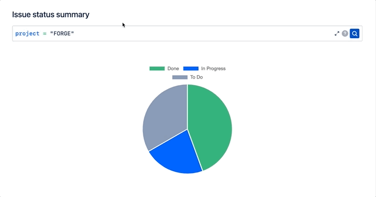

# Forge JQL Editor App

# Used the below app to recreate the bug with the issue view modal focus flicker. Follow the same instructions below to run this app

[](LICENSE) [](CONTRIBUTING.md)

This project contains a Forge app written in Javascript that displays a JQL editor in a Jira project page. 

See [developer.atlassian.com/platform/forge/](https://developer.atlassian.com/platform/forge) for documentation and tutorials explaining Forge.



## Requirements

See [Set up Forge](https://developer.atlassian.com/platform/forge/set-up-forge/) for instructions to get set up.

## Quick start
- Install dependecies (inside root directory)
```
npm install
```
- Install dependencies (inside of the `static/app` directory)::
```
npm install
```

- Modify your app by editing the files in `static/app/src/`.

- Build your app (inside of the `static/app` directory):
```
npm run build
```

- Register the app you didn't create so you can run commands for it, by running:
```
forge register
```

- Deploy your app by running:
```
forge deploy
```

- Install your app in an Atlassian site by running:
```
forge install
```

### Notes
- Use the `forge deploy` command when you want to persist code changes.
- Use the `forge install` command when you want to install the app on a new site.
- Once the app is installed on a site, the site picks up the new app changes you deploy without needing to rerun the install command.

## Support

See [Get help](https://developer.atlassian.com/platform/forge/get-help/) for how to get help and provide feedback for 
the Forge platform.

For developers outside of Atlassian looking for help with the JQL editor, or to report issues, [please make a post on the community forum](https://community.developer.atlassian.com/c/atlassian-ecosystem-design).
We will monitor the forums and redirect topics to the appropriate maintainers.

## Contributions

Contributions to Forge JQL Editor App are welcome! Please see [CONTRIBUTING.md](CONTRIBUTING.md) for details.

## License

Copyright (c) 2021 - 2022 Atlassian and others.
Apache 2.0 licensed, see [LICENSE](LICENSE) file.

<br/>

[](https://www.atlassian.com)
